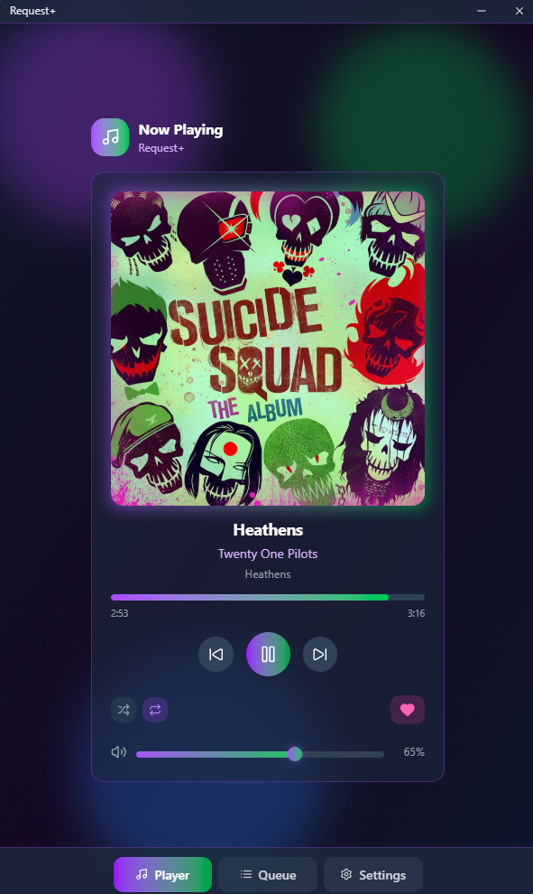

# Request+



Request+ is a desktop companion app for streamers who want chat-driven song requests, a polished "now playing" overlay, and multi-platform music control without turning their stream setup into a science project.

It connects your stream chat, your music player, and your OBS/Streamlabs overlay so viewers can request songs while you stay in control of playback, queue behavior, moderation rules, and what appears on stream.

> [!IMPORTANT]
> By using Request+, you agree to the [Request+ Terms of Service](https://requestplus.xyz/terms-of-service).

<br clear="right">

## What It Does

- Accept song requests from Twitch, Kick, and YouTube chat.
- Display current track information in a browser-source overlay for OBS and Streamlabs.
- Control and read playback state from Spotify, YouTube Music, Apple Music, and SoundCloud.
- Manage song queues, request approvals, skips, volume, seek, shuffle, repeat, and likes from the desktop app.
- Support optional streamer rules such as moderators-only, subscribers-only, manual queue approval, and Guess the Song.
- Keep the desktop client connected to the Request+ API with hardware/device authentication.
- Provide themed overlay styles that can be customized with CSS.

## Supported Music Sources

Request+ is built around a multi-platform playback layer:

| Platform | Integration | Is Experimental
| --- | --- | ---
| Spotify | Spicetify extension and local WebSocket bridge | No
| YouTube Music | Pear Desktop / YouTube Music API bridge | No
| Apple Music | Cider RPC / Apple Music handler | No
| SoundCloud | Local SoundCloud handler | Yes

Not every source supports every playback action equally. Request+ uses the best available controls for each platform and falls back where a platform has limited local APIs.

## Stream Chat Support

Request+ can receive song requests from:

- Twitch
- Kick
- YouTube live chat

Typical viewer flow:

```text
!sr never gonna give you up
!sr https://open.spotify.com/track/...
!sr https://music.youtube.com/watch?v=...
!sr https://music.apple.com/...
```

The desktop client sends requests to the active music platform, updates the queue, and reports status back through the Request+ API.

## Overlay

The included overlay is designed for OBS and Streamlabs browser sources. It shows:

- Song title and artist
- Album art
- Playback progress
- Hidden-song state for Guess the Song
- Theme-specific styling

Overlay files live in `src/views/`, with CSS themes in `src/views/styles/`. If installed, it lives at the users data folders like `%appdata%/Request+` `~\Library\Application Support\Request+`, and I haven't tested linux.

## Installation

The easiest way to use Request+ is to install a release build:

[Download Request+ from GitHub Releases](https://github.com/DarkWolfie-YouTube/requestplus/releases) or the Official [Website](https://requestplus.xyz/downloads)

Platform packages may include:

- Windows installer or portable build
- Windows MSIX/AppX package
- macOS package
- Linux package

For setup guides, platform requirements, and overlay instructions, visit:

[https://requestplus.xyz/docs](https://requestplus.xyz/docs)

## Requirements

At least one supported music player/bridge is needed:

- Spotify Desktop with Spicetify configured
- Pear Desktop for YouTube Music
- Cider for Apple Music
- SoundCloud support where available

For chat requests, connect the relevant streaming account on your account [here](https://requestplus.xyz/dashboard).

## Development

Request+ is an Electron, React, TypeScript, and Vite app.

```bash
npm install
npm run start
```

Build/package commands:

```bash
npm run make
npm run package
npm run build:appx
npm run build:nsis
npm run build:portable
```

Useful files:

| File | Purpose |
| --- | --- |
| `src/main.ts` | Electron main process and app lifecycle |
| `src/preload.ts` | Safe bridge between renderer and Electron APIs |
| `src/renderer.tsx` | Main React renderer entry |
| `src/apiHandler.ts` | Local API surface used by overlay and auth flows |
| `src/multiPlatformHandler.ts` | Chooses and coordinates active music platforms |
| `src/playbackHandler.ts` | Playback metadata and controls |
| `src/websocketweb.ts` | Request+ API WebSocket client |
| `src/views/overlay.html` | Browser-source overlay |

## Configuration

Runtime API endpoints are selected in `src/config.ts`.

The app uses production Request+ services by default and can switch to test endpoints when the Electron app is not packaged.

Do not commit real secrets, tokens, certificates, or private environment values.

## Privacy

Request+ only stores the account and connection data needed to provide chat requests, authentication, linked-platform status, and desktop-device access. Music playback history is not treated as a public feature of the product.

More detail:

[Request+ Privacy Policy](https://requestplus.xyz/privacy-policy)

## Contributing

Contributions are welcome.

1. Fork the repository.
2. Create a branch for your change.
3. Keep changes focused and test the app locally.
4. Open a pull request with a clear summary.

```bash
git checkout -b feature/my-change
```

## License

Request+ is licensed under the GNU GPLv3.

Copyright (c) 2025 Quil DayTrack (https://darkwolfie.com).

## Links

- Website: [https://requestplus.xyz](https://requestplus.xyz)
- Docs: [https://requestplus.xyz/docs](https://requestplus.xyz/docs)
- Releases: [https://github.com/DarkWolfie-YouTube/requestplus/releases](https://github.com/DarkWolfie-YouTube/requestplus/releases)
- Discord: [https://discord.gg/gXDFGAhvNY](https://discord.gg/gXDFGAhvNY)
